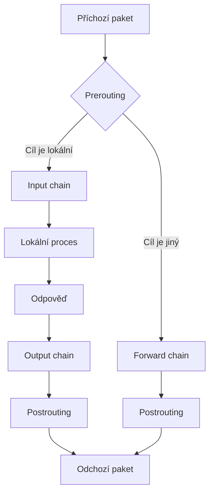

# 24. Firewall
> **Linux Firewall** — iptables, nftables, ufw a další nástroje

---

## Úvod

Firewall je základní bezpecnostní prvek kazdého OS. V Linuxu pracuje na úrovni jádra a filtruje pakety podle pravidel administrátora. Linuxový firewall je soucástí kernelu od roku 1994 a prosel vývojem od ipchains pres iptables az po nftables.

Hlavní úkoly firewallu:

- **Filtrování paketu** — povolení nebo zamítnutí provozu podle zdroje, cíle, portu a protokolu.
- **NAT** — preklad adres mezi vnitrní a vnejsí sítí.
- **Connection tracking** — sledování stavu spojení.
- **Rate limiting** — omezení rychlosti proti DoS.
- **Logování** — záznam podezrelé aktivity.

| Nástroj | Popis | Platforma |
|---------|-------|-----------|
| iptables | Klasický packet filter (Netfilter) | Univerzální |
| nftables | Moderní nástupce iptables (kernel 3.13+) | Univerzální |
| ufw | Zjednodusený wrapper nad iptables/nftables | Ubuntu/Debian |
| firewalld | Dynamický firewall se zónami | RHEL/Fedora/CentOS |

> Tato kapitola navazuje na základní prehled v [kapitole 7](07-bezpecna-architektura.md). Zatímco kapitola 7 uvádí jen základ, zde se venujeme detailnímu fungování a praktickým scénárum.

---

## 1. Pruchod paketu Linux firewallem

Abychom rozumeli pravidlum, musíme pochopit, jak paket prochází jádrem. Síťový stack je rozlozen do nekolika hook bodu.



### Slovní popis toku

Paket prochází hook body v poradí:

1. **PREROUTING** — paket vstupuje do systému. Zde beí úprava hlavicek (mangle) a preklad cílové adresy DNAT (nat). Hook je v tabulkách raw, mangle a nat.

2. **Routing decision** — jádro rozhodne, zda je cíl lokální nebo presmerovaný.

3. **INPUT** — pri lokálním cíli paket vstupuje do INPUT (filter, mangle, security). Zde rozhodujeme o povolení nebo zahození.

4. **FORWARD** — pri cizím cíli paket prochází FORWARD (filter, mangle, security).

5. **OUTPUT** — paket z lokálního procesu prochází OUTPUT (raw, mangle, nat, filter, security).

6. **POSTROUTING** — poslední fáze pred odesláním. Zde probíhá SNAT/MASQUERADE. Hook je v mangle a nat.

### Poradí tabulek u kazdého hooku

| Hook | Poradí tabulek |
|------|---------------|
| PREROUTING | raw → mangle → nat |
| INPUT | mangle → filter → security |
| FORWARD | mangle → filter → security |
| OUTPUT | raw → mangle → nat → filter → security |
| POSTROUTING | mangle → nat |

Toto poradí je klícové. Napríklad pravidlo v raw se zpracuje dríve nez v filter.

---

## 2. Retezce (chains) a tabulky

Netfilter pouzívá tabulky a retezce. Kazdá tabulka sdruzuje retezce se stejnm úcelem. Retezec je sekvence pravidel vyhodnocovaných postupne.

### Prehled tabulek

| Tabulka | Built-in retezce | Úcel | Príklad |
|---------|-----------------|------|---------|
| filter | INPUT, OUTPUT, FORWARD | Filtrování paketu | `iptables -A INPUT -p tcp --dport 22 -j ACCEPT` |
| nat | PREROUTING, POSTROUTING, OUTPUT | Preklad adres (NAT) | `iptables -t nat -A POSTROUTING -o eth0 -j MASQUERADE` |
| mangle | PREROUTING, INPUT, FORWARD, OUTPUT, POSTROUTING | Úprava hlavicek (TOS, TTL) | `iptables -t mangle -A PREROUTING -j TTL --ttl-set 64` |
| raw | PREROUTING, OUTPUT | Vyrazení z connection tracking | `iptables -t raw -A PREROUTING -p tcp --dport 80 -j NOTRACK` |
| security | INPUT, OUTPUT, FORWARD | SELinux znacení | `iptables -t security -A INPUT -j SECMARK --selctx system_u:object_r:httpd_packet_t:s0` |

### Uzivatelem definované retezce

Vedle built-in retezcu si lze vytváret vlastní, napríklad pro organizaci slozitých pravidel:

```bash
# Vytvorení vlastního retezce
iptables -N SSH_BRUTE_FORCE
iptables -A INPUT -p tcp --dport 22 -j SSH_BRUTE_FORCE

# Pravidla uvnitr retezce
iptables -A SSH_BRUTE_FORCE -m recent --set --name SSH
iptables -A SSH_BRUTE_FORCE -m recent --update --seconds 60 --hitcount 4 --name SSH -j DROP
iptables -A SSH_BRUTE_FORCE -j ACCEPT
```

### Policy (výchozí politika)

Built-in retezec má výchozí politiku (obvykle ACCEPT). Pro bezpecnost se mení na DROP:

```bash
iptables -P INPUT DROP
iptables -P FORWARD DROP
iptables -P OUTPUT ACCEPT
```

### Connection tracking

Sledování stavu spojení umoznuje rozhodovat podle stavu, ne jen podle jednotlivých paketu:

| Stav | Význam | Popis |
|------|--------|-------|
| NEW | Nové spojení | První paket (napr. SYN) |
| ESTABLISHED | Navázané spojení | Pakety existujícího spojení |
| RELATED | Související spojení | Nové spojení z existujícího (FTP data) |
| INVALID | Neplatný | Paket bez platného stavu |

```bash
# Povolení jen navázaných spojení
iptables -A INPUT -m conntrack --ctstate ESTABLISHED,RELATED -j ACCEPT

# Zamítnutí neplatných
iptables -A INPUT -m conntrack --ctstate INVALID -j DROP
```

### DROP vs REJECT

| Target | Chování | Výhoda | Nevýhoda |
|--------|---------|--------|----------|
| DROP | Tiché zahození | Útokník netusí, zda stroj existuje | Zpusobuje timeouty |
| REJECT | Chybová odpoved | Rychlý feedback | Prozrazuje aktivitu stroje |

```bash
iptables -A INPUT -p tcp --dport 23 -j DROP
iptables -A INPUT -p tcp --dport 23 -j REJECT --reject-with tcp-reset
```

---

## 3. iptables — klasický nástroj

**iptables** je tradicní nástroj pro Netfilter, dostupný na vsech distribucích od roku 2001.

### Základní príkazy

| Príkaz | Význam | Príklad |
|--------|--------|---------|
| `-A` (append) | Pridání na konec retezce | `iptables -A INPUT -p tcp --dport 22 -j ACCEPT` |
| `-I` (insert) | Vlození na pozici | `iptables -I INPUT 1 -p tcp --dport 22 -j DROP` |
| `-D` (delete) | Smazání | `iptables -D INPUT 3` |
| `-L` (list) | Výpis | `iptables -L INPUT -n -v` |
| `-F` (flush) | Vymazání pravidel | `iptables -F INPUT` |
| `-P` (policy) | Výchozí politika | `iptables -P INPUT DROP` |
| `-N` (new chain) | Nový retezec | `iptables -N MY_CHAIN` |
| `-X` (delete chain) | Smazání retezce | `iptables -X MY_CHAIN` |

### Targets

```bash
# ACCEPT — povolení
iptables -A INPUT -p tcp --dport 80 -j ACCEPT

# DROP — zahození
iptables -A INPUT -p tcp --dport 23 -j DROP

# REJECT — zamítnutí s odpovedí
iptables -A INPUT -p tcp --dport 23 -j REJECT --reject-with icmp-port-unreachable

# LOG — zalogování a pokracování
iptables -A INPUT -p tcp --dport 22 -j LOG --log-prefix "SSH: "

# RETURN — návrat z vlastního retezce
iptables -A MY_CHAIN -j RETURN
```

### Match conditions

```bash
# Zdrojová adresa
iptables -A INPUT -p tcp --dport 22 -s 10.0.0.0/24 -j ACCEPT

# Cílový port
iptables -A INPUT -p tcp --dport 80 -j ACCEPT

# Vstupní rozhraní
iptables -A INPUT -i eth0 -p tcp --dport 443 -j ACCEPT

# Protokol ICMP
iptables -A INPUT -p icmp --icmp-type echo-request -j ACCEPT
```

### Moduly (-m)

```bash
# conntrack
iptables -A INPUT -m conntrack --ctstate ESTABLISHED,RELATED -j ACCEPT

# recent — proti brute force
iptables -A INPUT -p tcp --dport 22 -m recent --set --name SSH
iptables -A INPUT -p tcp --dport 22 -m recent --update --seconds 60 --hitcount 4 --name SSH -j DROP

# limit — proti DoS
iptables -A INPUT -p icmp --icmp-type echo-request -m limit --limit 1/s -j ACCEPT
iptables -A INPUT -p icmp --icmp-type echo-request -j DROP

# multiport — více portu
iptables -A INPUT -p tcp -m multiport --dports 80,443,8080 -j ACCEPT
```

### Ulození a obnovení

Pravidla iptables nejsou perzistentní. Je treba je ulozit:

```bash
# Ulození
iptables-save > /etc/iptables/rules.v4

# Obnovení
iptables-restore < /etc/iptables/rules.v4

# Automaticky (iptables-persistent)
apt install iptables-persistent
systemctl enable netfilter-persistent
```

### IPv6 a iptables-legacy vs iptables-nft

Pro IPv6 slouzí samostatný `ip6tables` se stejnou syntaxí. Na moderních distribucích (Debian 10+, Ubuntu 20.04+) existují dve varianty:

```bash
# Zjistení varianty
iptables --version
# iptables v1.8.7 (nf_tables)   ← iptables-nft
# iptables v1.8.7 (legacy)       ← iptables-legacy
```

> **Poznámka:** iptables je zastaralý. Nové projekty by mely pouzívat nftables (sekce 4).

---

## 4. nftables — moderní nástupce

**nftables** je nástupce iptables (kernel 3.13+, 2014). Nahrazuje iptables, ip6tables, arptables a ebtables jednou unified architekturou.

### Hlavní výhody

- Jednotná syntaxe pro IPv4 i IPv6 (díky `inet` family).
- Rychlejsí — pravidla se kompilují do bytecodu.
- Vestavné sets, maps a verdict maps.
- Atomické hromadné operace.
- Monitoring pres `nft monitor`.

### Základní príkazy

```bash
# Výpis rulesetu
nft list ruleset

# Vytvorení tabulky s retezcem
nft add table inet filter
nft add chain inet filter input { type filter hook input priority 0\; policy drop\; }

# Pridání pravidla
nft add rule inet filter input iif lo accept
nft add rule inet filter input ct state established,related accept
nft add rule inet filter input tcp dport { 22, 80, 443 } accept

# Smazání pravidla (potrebujeme handle)
nft -a list ruleset
nft delete rule inet filter input handle 3
```

### inet family

Nejvetsí novinka: `inet` family sdruzuje IPv4 a IPv6. Uz není treba psát pravidla pro iptables i ip6tables zvlast:

```bash
# Toto platí pro IPv4 i IPv6
nft add table inet filter
nft add chain inet filter input { type filter hook input priority 0\; policy drop\; }
nft add rule inet filter input tcp dport 80 accept
```

Pro protokol-specifická pravidla existují `ip` a `ip6` family:

```bash
nft add table ip filter
nft add rule ip filter input ip saddr 10.0.0.0/24 tcp dport 22 accept
```

### Sets (mnoziny)

Efektivní skupiny adres, portu nebo rozhraní:

```bash
# Vytvorení setu a pridání prvku
nft add set inet filter allowed_ports { type inet_service\; }
nft add element inet filter allowed_ports { 80, 443, 8080 }

# Pouzití v pravidle
nft add rule inet filter input tcp dport @allowed_ports accept

# Dynamický set pro blackhole
nft add set inet filter blackhole { type ipv4_addr\; flags dynamic\; }
nft add rule inet filter input ip saddr @blackhole drop
```

### Named counters a maps

```bash
# Pojmenované pocítadlo
nft add counter inet filter web_traffic
nft add rule inet filter input tcp dport 80 counter name web_traffic
nft list counter inet filter web_traffic

# Mapování port -> akce
nft add map inet filter port_map { type inet_service : verdict\; }
nft add element inet filter port_map { 80 : accept, 443 : accept, 22 : drop }
nft add rule inet filter input tcp dport vmap @port_map
```

### Konfiguracní soubor

Hlavní konfigurace je v `/etc/nftables.conf`. Lze ji nacíst pres `nft -f`:

```bash
#!/usr/sbin/nft -f
# /etc/nftables.conf

flush ruleset

table inet filter {
  chain input {
    type filter hook input priority 0; policy drop;
    iif lo accept
    ct state established,related accept
    tcp dport { 22, 80, 443 } accept
  }
  chain forward {
    type filter hook forward priority 0; policy drop;
  }
  chain output {
    type filter hook output priority 0; policy accept;
  }
}
```

```bash
# Nactení a systemd
sudo nft -f /etc/nftables.conf
sudo systemctl enable nftables
sudo systemctl start nftables
```

### Prevod z iptables

```bash
# iptables-translate ukáze nftables ekvivalent
iptables-translate -A INPUT -p tcp --dport 22 -j ACCEPT
# nft add rule ip filter INPUT tcp dport 22 accept
```

---

## 5. UFW — jednoduchý firewall pro uzivatele

**UFW** (Uncomplicated Firewall) je uzivatelsky prívetivý wrapper nad iptables/nftables. Standardne soucást Ubuntu od 8.04 LTS.

> **Platforma:** Ubuntu/Debian

### Základní správa

```bash
# Zapnutí / vypnutí / restart
sudo ufw enable
sudo ufw disable
sudo ufw reload

# Stav s detaily
sudo ufw status verbose
# Status: active
# Default: deny (incoming), allow (outgoing)

# Stav s císly (pro mazání)
sudo ufw status numbered
#      To                         Action      From
# -- ------                         ------      ----
# [ 1] 22/tcp                     ALLOW IN    Anywhere
# [ 2] 80/tcp                     ALLOW IN    Anywhere
```

### Pravidla

```bash
# Povolení portu
sudo ufw allow 80/tcp
sudo ufw allow 443/tcp

# Zamítnutí
sudo ufw deny 23/tcp

# Ze zdrojové adresy
sudo ufw allow from 10.0.0.0/24 to any port 22

# Na konkrétní rozhraní
sudo ufw allow in on eth0 to any port 80

# Smazání podle císla nebo specifikace
sudo ufw delete 3
sudo ufw delete allow 80/tcp
```

### Profily aplikací

Místo portu lze pouzít pojmenované profily:

```bash
# Seznam profilu
sudo ufw app list
# Available applications:
#   OpenSSH
#   Apache Full
#   Postfix

# Detail profilu
sudo ufw app info 'Apache Full'
# Ports: 80,443/tcp

# Povolení podle profilu
sudo ufw allow 'OpenSSH'
sudo ufw allow 'Apache Full'
```

### Logování a konfigurace

```bash
# Úrovne logování
sudo ufw logging low     # jen blokované
sudo ufw logging medium  # blokované + povolené
sudo ufw logging high    # vse

# Logy v /var/log/ufw.log
tail -f /var/log/ufw.log
```

Konfiguracní soubor `/etc/default/ufw`:

```ini
IPV6=yes
DEFAULT_INPUT_POLICY="DROP"
DEFAULT_OUTPUT_POLICY="ACCEPT"
DEFAULT_FORWARD_POLICY="DROP"
```

Pravidla jsou ulozena v `/etc/ufw/` (user.rules, before.rules, after.rules).

### Suchý beh

```bash
sudo ufw --dry-run allow 8080/tcp
```

UFW je wrapper — pri kazdém príkazu prepisuje jaderná pravidla. Na novsích Ubuntu pouzívá nftables backend:

```bash
ufw version | grep backend
# (backend: nftables)
```

---

## 6. Dalsí firewall resení v Linuxu

### firewalld

Dynamický firewall se zónami, standard na RHEL/Fedora/CentOS. Místo retezcu pouzívá zóny a sluzby.

> **Platforma:** RHEL/Fedora/CentOS

| Zóna | Úroven duvery | Pouzití |
|------|--------------|---------|
| drop | Nejnizsí | Vse zahozeno |
| block | Nízká | Vse zamítnuto |
| public | Strední | Verejné síte (výchozí) |
| external | Strední | Externí síte s NAT |
| internal | Vysoká | Vnitrní síte |
| dmz | Vysoká | DMZ servery |
| trusted | Nejvyssí | Vse povoleno |

```bash
# Základní správa
sudo systemctl start firewalld
sudo systemctl enable firewalld

# Zobrazení zon
sudo firewall-cmd --get-default-zone
# public
sudo firewall-cmd --get-active-zones
# public (interfaces: eth0)

# Detail zóny
sudo firewall-cmd --zone=public --list-all
# public (active)
#   services: cockpit dhcpv6-client ssh
#   ports: 80/tcp 443/tcp

# Pridání sluzby/portu
sudo firewall-cmd --zone=public --add-service=http
sudo firewall-cmd --permanent --zone=public --add-port=8080/tcp
sudo firewall-cmd --reload
```

Rich rules pro komplexní podmínky:

```bash
# SSH jen z administracní síte
sudo firewall-cmd --permanent \
  --add-rich-rule='rule family="ipv4" source address="10.0.0.0/24" \
  service name="ssh" accept'

# Rate limiting SSH
sudo firewall-cmd --permanent \
  --add-rich-rule='rule service name="ssh" limit value="4/m" accept'

sudo firewall-cmd --reload
```

### bpfilter / eBPF

Linux kernel od 5.x obsahuje experimentální bpfilter pro eBPF-based packet filtering. Není urceno pro beznou správu, stále ve vývoji.

### Varování: konflikt nástroju

UFW a firewalld nesmí bezet soucasne — oba spravují stejné jaderné tabulky a vzájemne se prepisují.

```bash
# Kontrola
sudo ufw status
sudo systemctl status firewalld
```

---

## 7. Praktický príklad — firewall pro webový server

Kompletní konfigurace pro webový server s HTTP, HTTPS a SSH omezeným na administracní síť. Tresti varianty.

### Varianta 1: iptables

```bash
#!/bin/bash
# firewall-web.sh - iptables

iptables -P INPUT DROP
iptables -P FORWARD DROP
iptables -P OUTPUT ACCEPT

# Loopback a stavová spojení
iptables -A INPUT -i lo -j ACCEPT
iptables -A INPUT -m conntrack --ctstate ESTABLISHED,RELATED -j ACCEPT

# HTTP/HTTPS
iptables -A INPUT -p tcp --dport 80 -j ACCEPT
iptables -A INPUT -p tcp --dport 443 -j ACCEPT

# SSH (jen administracní sí)
iptables -A INPUT -p tcp --dport 22 -s 10.0.0.0/24 -j ACCEPT

# Rate limiting SSH brute force
iptables -A INPUT -p tcp --dport 22 -m state --state NEW \
  -m recent --set --name SSH
iptables -A INPUT -p tcp --dport 22 -m state --state NEW \
  -m recent --update --seconds 60 --hitcount 4 --name SSH -j DROP

# Ochrana proti skenování portu
iptables -A INPUT -m recent --name portscan --rcheck --seconds 60 -j DROP
iptables -A FORWARD -m recent --name portscan --rcheck --seconds 60 -j DROP
iptables -A INPUT -m recent --name portscan --set -j LOG --log-prefix "Portscan:"
iptables -A FORWARD -m recent --name portscan --set -j LOG --log-prefix "Portscan:"

# ICMP ping s omezením
iptables -A INPUT -p icmp --icmp-type echo-request -m limit --limit 1/s -j ACCEPT
iptables -A INPUT -p icmp --icmp-type echo-request -j DROP

# Ulození
iptables-save > /etc/iptables/rules.v4
```

Ocekavaný výstup:

```
Chain INPUT (policy DROP)
num  target     prot opt source           destination
1    ACCEPT     all  --  0.0.0.0/0        0.0.0.0/0
2    ACCEPT     all  --  0.0.0.0/0        0.0.0.0/0        ctstate RELATED,ESTABLISHED
3    ACCEPT     tcp  --  0.0.0.0/0        0.0.0.0/0        tcp dpt:80
4    ACCEPT     tcp  --  0.0.0.0/0        0.0.0.0/0        tcp dpt:443
5    ACCEPT     tcp  --  10.0.0.0/24      0.0.0.0/0        tcp dpt:22
6    DROP       tcp  --  0.0.0.0/0        0.0.0.0/0        recent: UPDATE hits 4 name SSH
7    DROP       all  --  0.0.0.0/0        0.0.0.0/0        recent: CHECK name portscan
8    LOG        all  --  0.0.0.0/0        0.0.0.0/0        LOG: Portscan:
9    ACCEPT     icmp --  0.0.0.0/0        0.0.0.0/0        limit: 1/s
10   DROP       icmp --  0.0.0.0/0        0.0.0.0/0        icmptype 8
```

### Varianta 2: nftables

```bash
#!/usr/sbin/nft -f
# firewall-web.nft - nftables

table inet filter {
  chain input {
    type filter hook input priority 0; policy drop;
    iif lo accept
    ct state established,related accept
    tcp dport { 80, 443 } accept
    ip saddr 10.0.0.0/24 tcp dport 22 accept
    tcp dport 22 ct state new limit rate 4/minute accept
    tcp dport 22 ct state new drop
    icmp type echo-request limit rate 1/second accept
    icmp type echo-request drop
    log prefix "nft-drop: " flags all
  }
  chain forward {
    type filter hook forward priority 0; policy drop;
  }
  chain output {
    type filter hook output priority 0; policy accept;
  }
}
```

Rozdíly oproti iptables:

- **`inet` family** — IPv4 i IPv6 soucasne.
- **`tcp dport { 80, 443 }`** — set syntaxe, není treba multiport modul.
- **`limit rate 4/minute`** — vestavné, není treba `recent` modul.
- **`log prefix`** — vestavné logování s flags.

```bash
sudo nft -f /etc/nftables.conf
```

### Varianta 3: UFW

```bash
# firewall-web.ufw
ufw default deny incoming
ufw default allow outgoing
ufw allow 80/tcp
ufw allow 443/tcp
ufw allow from 10.0.0.0/24 to any port 22
ufw enable
```

Ocekavaný výstup:

```
Status: active
Default: deny (incoming), allow (outgoing)
To                         Action      From
--                         ------      ----
22/tcp                     ALLOW IN    10.0.0.0/24
80/tcp                     ALLOW IN    Anywhere
443/tcp                    ALLOW IN    Anywhere
```

### Perzistence

```bash
# iptables
iptables-save > /etc/iptables/rules.v4
# nftables
systemctl enable nftables
# UFW
ufw enable   # automaticky
```

---

## Shrnutí

| Nástroj | Slozitost | IPv6 podpora | Vhodné pro | Platforma |
|---------|-----------|-------------|------------|-----------|
| iptables | Strední | Samostatný ip6tables | Legacy systémy | Univerzální |
| nftables | Strední | Integrovaná (inet) | Nové projekty | Univerzální |
| UFW | Nízká | Ano | Ubuntu/Debian | Ubuntu/Debian |
| firewalld | Nízká (zóny) | Ano | RHEL/Fedora | RHEL/Fedora/CentOS |

### Dulezité body

- **Pouzívejte nftables** pro nové instalace. iptables je zastaralý.
- **Priorita tabulek**: raw → mangle → nat → filter → security.
- **Connection tracking** je klícový — vzdy povolte ESTABLISHED,RELATED jako první.
- **DROP vs REJECT** — DROP je bezpecnejsi, REJECT lépe informuje.
- **UFW a firewalld nesmí bezet** soucasne — konflikt.
- **Pravidla nejsou perzistentní** — musíte je ulozit nebo pouzít nástroj s automatickým ukládáním.
- **Testujte postupne** — spatné pravidlo vás muze odstrihnout.

```bash
# Bezpecnostní pojistka: automatický rollback za 5 minut
at now +5 minutes <<< "iptables -F; iptables -P INPUT ACCEPT"
```

---

➡️ [Zpět na přehled](README.md)
