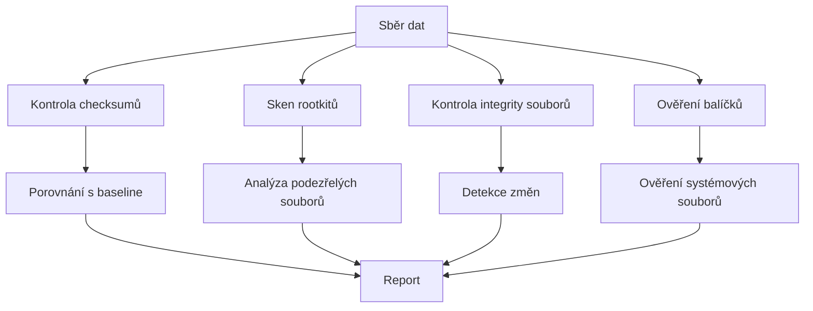
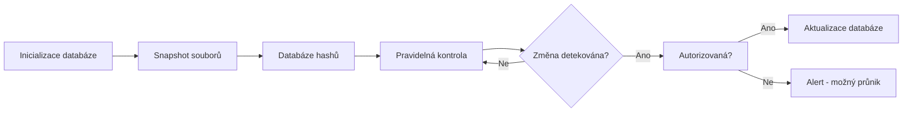

# 25. Bezpečnostní audit a detekce průniku
> Resení zabezpecení, kontrola integrity a detekce nelegálního prístupu v Linuxu

---

## Úvod

Bezpecnostní audit je systematická kontrola systému s cílem odhalit neoprávnené zmeny, skrytý malware, rootkity nebo jinou podezrelou aktivitu. Zatímco kapitola 7 se venovala základní bezpecné architekture a kapitola 24 firewallu, tato kapitola se zamERuje na nástroje pro detekci jiz probihajícího nebo probehlého útoku.

Bezpecnostní audit delíme na nekolik oblasti:

- **Kontrola integrity souboru** — overení, zda se soubory od poslední známé verze nezmenily (checksumy).
- **Detekce rootkitu** — hledání skrytých modulu, procesu a zmenených systémových binárek.
- **Sledování zmen v kritických adresárich** — nástroje jako AIDE nebo Tripwire.
- **Overení nainstalovaných balícku** — kontrola, zda binární soubory balícku nebyly pozmeneny.
- **Automatizace pravidelného auditu** — skripty a cron úlohy.



> **Predpoklady:** Základní znalost bash príkazu (kapitoly 1, 2), správy balícku (kapitola 10) a souborových práv (kapitola 12).

---

## 1. Kontrolní soucty (checksumy)

Kontrolní soucet (hash, fingerprint) je jednosmerný otisk souboru. Pokud se soubor byt jen nepatrne zmení, výsledný hash je zcela jiný. To umoznuje detekovat i sebemensí zmeny.

### Pouzité nástroje

| Nástroj | Príkaz | Soucást |
|---------|--------|---------|
| MD5 | `md5sum` | coreutils |
| SHA-1 | `sha1sum` | coreutils |
| SHA-256 | `sha256sum` | coreutils |
| BLAKE2 | `b2sum` | coreutils |

Vsechny nastroje jsou soucástí balícku `coreutils`, tedy dostupné na kazdé Linuxové distribuci.

### Generování checksumu

```bash
# SHA-256 otisk jednoho souboru
sha256sum /etc/passwd
# a1b2c3d4e5f6...   /etc/passwd

# Ulození do souboru (baseline)
sha256sum /etc/passwd > passwd.sha256

# Více souboru najednou
sha256sum /etc/passwd /etc/shadow /etc/group > baseline.sha256
# a1b2c3...  /etc/passwd
# d4e5f6...  /etc/shadow
# g7h8i9...  /etc/group
```

### Ooverení

```bash
# Ooverení jednoho souboru
sha256sum -c passwd.sha256
# /etc/passwd: OK

# Ooverení vsech souboru v baseline
sha256sum -c baseline.sha256
# /etc/passwd: OK
# /etc/shadow: OK
# /etc/group: OK
```

Pri neshode vypadá výstup takto:

```bash
sha256sum -c baseline.sha256
# /etc/passwd: OK
# /etc/shadow: FAILED
# /etc/group: OK
# sha256sum: WARNING: 1 computed checksum did NOT match
```

### Ostatní algoritmy

```bash
# MD5 (jen pro kompatibilitu, ne pro bezpecnost)
md5sum /etc/passwd
# 5d41402abc4b2a76b9719d911017c592  /etc/passwd

# SHA-1 (oslabený, nedoporucuje se)
sha1sum /etc/passwd

# BLAKE2b (moderní, rychlý)
b2sum /etc/passwd
```

### Porovnání algoritmu

| Algoritmus | Delka hash | Rychlost | Bezpecnost | Pouzití |
|------------|-----------|----------|------------|---------|
| MD5 | 128 bitu / 32 znaku | Velmi rychlý | Není bezpecný | Kontrola integrity (ne kryptografie) |
| SHA-1 | 160 bitu / 40 znaku | Rychlý | Oslabený | Legacy systémy |
| SHA-256 | 256 bitu / 64 znaku | Strední | Bezpecný | Standard pro overování souboru |
| BLAKE2b | 512 bitu / 128 znaku | Velmi rychlý | Bezpecný | Moderní alternativa SHA-256 |

### Bezpecnostní poznamky

- **MD5** má znamé kolize (dva ruzné soubory mohou mít stejný hash). Nepouzívejte ho pro bezpecnostní úcely, jen pro kontrolu nezávaVných dat.
- **SHA-1** je teoreticky oslabený (2017 publikován útok SHAttered na kolizi). Staré systémy jej mohou pouzívat, pro nové projekty zvolte SHA-256.
- **SHA-256** je aktuální standard. Pouzívá se pro podpisy balícku, certifikáty a integrityní kontrolu.
- **BLAKE2b** je moderní algoritmus, rychlejsí nez SHA-256 na 64bitových systémech. Soucást coreutils (b2sum) od coreutils 8.26.

> **Poznámka:** Checksum pouze kontroluje integritu souboru, ne autenticitu (kdo soubor vytvoril). Pro overení puvodu pouzijte GPG podpis (`gpg --verify`).

---

## 2. Detekce rootkitu

Rootkit je software, který se po pruniku do systému snazí utajit svou prítomnost. Typicky modifikuje systémová volání, skryvá procesy, soubory a síové spojení pred standardními nástroji (ps, ls, netstat).

### Jak rootkity fungují

- **Kernel rootkity** — modifikují jádro nebo nacítají vlastní modul. Skryjí procesy a soubory na úrovni jádra (napr. `sys_call_table` hooking).
- **Userland rootkity** — nahrazují systémové binárky (ps, ls, netstat) vlastními verzemi, které neukazují skryté polozky.
- **Bootkit** — infikuje bootloader nebo MBR, nacítá se dríve nez OS.
- **Firmware rootkit** — infikuje firmware zarízení (UEFI, síová karta, disk).

### chkrootkit

chkrootkit je jednoduchý skener, který kontroluje znamé rootkity a podezrelé vzory v systému.

```bash
# Instalace
sudo apt install chkrootkit

# Spustení základní kontroly
sudo chkrootkit
```

Výstup je clenený do sekcí:

```
ROOTDIR is '/'
Checking 'direct'... not infected
Checking 'bindshell'... not infected
Checking 'lkm'... not infected
Checking 'chkutmp'... not infected
...
Checking 'php_includes'... not infected
```

Dulezité je hledat slovo `INFECTED`:

```bash
sudo chkrootkit | grep INFECTED
# (prazdný výstup = žádný nález)
```

Pokud chkrootkit neco najde:

```bash
sudo chkrootkit | grep INFECTED
# Checking 'scalper'... INFECTED
```

Varování: chkrootkit nekdy hlásí falesne poplachy na nekterých bezproblémových systémech. Vzdy overte rucne.

```bash
# Test "not tested" — moduly, které nebyly otestovány
sudo chkrootkit 2>&1 | grep "not tested"
```

### rkhunter (Rootkit Hunter)

rkhunter je komplexnejsí nastroj. Oproti chkrootkit kontroluje také systémové binárky (pomocí checksumu), skryté procesy a podezrelé stringy.

```bash
# Instalace
sudo apt install rkhunter

# Vytvorení databáze "known good" souboru (po instalaci)
sudo rkhunter --propupd

# Spustení kontroly (bez cekání na klávesu)
sudo rkhunter --check --skip-keypress
```

Pri prvním spustení rkhunter vytvorí databázi `/var/lib/rkhunter/db` s otisky systémových souboru. Pri dalsích kontrolách porovnává aktuální stav.

Výstup:

```
[ ok ] Checking for rootkits [ None found ]
[ ok ] Checking for malware [ None found ]
[ ok ] Checking for suspicious files [ None found ]
[ ok ] Checking file properties [ Warning ]
```

Varování u file properties znamená, ze se soubor od doby propupd zmenil (napr. po aktualizaci):

```
Warning: The file properties have changed:
  File: /bin/ls
  Current hash: a1b2c3...
  Stored hash: d4e5f6...
  Reason: Updated package
```

To je casto falesný poplach po apt upgrade. Resením je znovu spustit `rkhunter --propupd`.

### Automatizace pres cron

```bash
# Denní kontrola v 2:00, výsledky do logu
echo "0 2 * * * root /usr/bin/rkhunter --check --skip-keypress --report-warnings-only | mail -s 'RKhunter report' admin@example.com" | sudo tee /etc/cron.d/rkhunter
```

### Srovnání chkrootkit a rkhunter

| Vlastnost | chkrootkit | rkhunter |
|-----------|-----------|----------|
| Rychlost | Rychlý | Pomalejsí (kontroluje binárky) |
| Detekce rootkitu | Znamé rootkity | Znamé rootkity + podezrelé vzory |
| Kontrola binárek | Ne | Ano (pomocí hashe a vlastností) |
| Databáze | Není | Ano (`/var/lib/rkhunter/db`) |
| Falesné poplachy | Nekdy (závisí na systému) | Po aktualizacích casto |
| Vhodné pro | Rychlá orientacní kontrola | Pravidelný hloubkový audit |

> **Dulezité:** Oba nástroje detekují pouze *známé* rootkity. Nový nebo modifikovaný rootkit muze projít. Proto kombinujeme kontrolu rootkitu s overením integrity (AIDE, debsums).

---

## 3. Sledování integrity souboru

Pro kontrolu zmen v adresáRich jako `/etc`, `/bin`, `/sbin` nebo `/usr` slouzí dedikované integrityní nástroje. UmoVnují vzít "snapshot" kritických souboru a pravidelne jej porovnávat.

### AIDE (Advanced Intrusion Detection Environment)

AIDE vytvorí databázi hashu (SHA-256, SHA-512, RIPEMD160 atd.) ze sledovaných souboru. Pri kazdé kontrole porovná aktuální hashe s databází.

```bash
# Instalace
sudo apt install aide

# Inicializace databáze
sudo aideinit
# Výstup: 
# Start timestamp: 2025-01-17 10:00:00 +0000
# Processing: /etc/aide/aide.conf
# ...
# Done: 42 files, 12 directories, 0 errors
```

`aideinit` vytvorí `/var/lib/aide/aide.db.new`. Pro pouzití je treba přejmenovat:

```bash
sudo mv /var/lib/aide/aide.db.new /var/lib/aide/aide.db
```

Kontrola:

```bash
sudo aide --check
# AIDE found differences between database and filesystem!!
# ...
# Changed files:
# changed: /etc/hosts
# changed: /etc/ssh/sshd_config
```

Konfigurace v `/etc/aide/aide.conf` urcuje, co a jakým algoritmem se kontroluje:

```
# Sledovat /etc se SHA-256 a vsemi atributy
/etc p+i+n+u+g+s+m+c+sha256

# Nezahrnovat logy
!/var/log
```

Aktualizace databáze po legitinních zmenách:

```bash
# Po aktualizaci systemu
sudo aideinit
sudo mv /var/lib/aide/aide.db.new /var/lib/aide/aide.db
```

### Tripwire

Tripwire funguje na stejném principu jako AIDE, ale je konfiguracn nárocnejsí.

```bash
# Instalace
sudo apt install tripwire

# Konfigurace (policy)
sudo twadmin --create-polfile /etc/tripwire/twpol.txt

# Inicializace databáze
sudo tripwire --init

# Kontrola
sudo tripwire --check
```

Výstup:

```
Tripwire(R) 2.4.4 Integrity Check Report

Report generated: Mon Jan 17 10:00:00 2025

  Rule Name                       Severity Level    Added   Removed  Modified
  ----------                      --------------    -----   -------  --------
  Tripwire Data Files                 100             0        0        0
  Critical configuration files        100             0        0        0
  ...

Total files scanned:   425
Files added:           0
Files removed:         0
Files modified:        2    ← /etc/hosts, /etc/ssh/sshd_config

Modified objects:
"/etc/hosts"
"/etc/ssh/sshd_config"
```

Aktualizace po legitinní zmene:

```bash
sudo tripwire --update --twrfile /var/lib/tripwire/report/*.twr
```

### Workflow integrity monitoringu



### Srovnání AIDE vs Tripwire

| Vlastnost | AIDE | Tripwire |
|-----------|------|----------|
| Instalace | Jednoduchá | Slozitjsí (nutný klíc) |
| Rychlost | Rychlá | Pomalejsí |
| Konfigurace | `/etc/aide/aide.conf` | `/etc/tripwire/twpol.txt` + klíce |
| Databáze | Obyc. soubor | Sífrovaná + podepsaná |
| Hash algoritmy | SHA-256, SHA-512, RIPEMD160 | MD5, SHA-256, SHA-512 |
| Aktualizace | mv aide.db.new aide.db | `tripwire --update` |
| Vhodné pro | Ub/Deb/RHEL (univerzální) | Kdyz je treba podpis databáze |

> **Platformní poznámka:** Oba nástroje jsou dostupné na vsech Linuxových distribucích. AIDE je jednodussí na údrzbu a doporucujeme ho pro zatející uzivatele.

---

## 4. Integrita nainstalovaných balícku

Zatímco AIDE a checksumy kontrolují zmeny v libovolných souborech, debsums (Debian/Ubuntu) a `rpm --verify` (RHEL/Fedora) overují soubory primo proti databázi balíckového systému. To odhalí, zda byl binární soubor balícku pozmenen od jeho instalace.

### debsums (Debian/Ubuntu)

debsums porovnává nainstalované soubory s otisky ulozenými v balíckové databázi (`/var/lib/dpkg/info/*.md5sums`).

```bash
# Instalace
sudo apt install debsums

# Kontrola vsech balícku (jen zmenené)
sudo debsums -s
# (prazdný výstup = vse v porádku)

# Kontrola konkrétního balícku
debsums bash
# /bin/bash                                                  OK
# /bin/sh                                                    OK
# /usr/share/man/man1/bash.1.gz                              OK

# Pokud je soubor zmenen:
debsums bash
# /bin/bash                                                  FAILED
```

Parametr `-a` kontroluje i konfiguracní soubory:

```bash
sudo debsums -a
```

Kombinace s výpisem jen chyb:

```bash
sudo debsums -s
# /bin/ls                                                    FAILED
# /usr/bin/ps                                                FAILED
```

### rpm --verify (RHEL/Fedora/CentOS)

rpm vestavené (není treba instalovat):

```bash
# Kontrola vsech balícku
rpm -Va
# S.5....T.  c /etc/ssh/sshd_config
# .M......    /bin/ls
```

Výstupní kódování:

| Atribut | Význam |
|---------|--------|
| S | Velikost se lisí |
| M | Práva se lisí |
| 5 | MD5 checksum (obsah) se lisí |
| D | Major/minor císla se lisí |
| L | Symlink se lisí |
| T | Cas modifikace se lisí |
| c | Konfiguracní soubor (config) |
| d | Dokumentacní soubor (doc) |

Kontrola konkrétního balícku:

```bash
rpm -V bash
# (prazdný výstup = vse OK)

rpm -V coreutils
# S.5....T.    /bin/ls
```

### Co delat, kdyz hash nesouhlasi

1. Zjistete, jestli soubor nebyl zmenen aktualizací (apt upgrade / dnf update).
2. Pokud ano, je to v porádku — databáze se po aktualizaci sama obnoví.
3. Pokud ne, a zmena není zaznamenaná v logu, je to vázný problém. Muze jít o rootkit, ktery nahradil binární soubory.
4. Bezte okamzite k bodu 7 (Praktický príklad).

> **Platformní poznamka:** `debsums` je dostupný na Debian/Ubuntu a odvozených distribucích. `rpm --verify` je vestavený v RHEL/Fedora/CentOS a odvozených. Na systemd distribucích lze pouzít také `systemd-analyze verify` pro kontrolu unit souboru.

---

## 5. Prepocy checksumu po aktualizacích

Kazdá aktualizace systému (`apt upgrade`, `dnf update`) mení binární soubory. Pokud nepřepocteme integrityní databáze, povedou dalsí kontroly k falesným poplachum.

### AIDE automatizace

Po apt upgrade je treba databázi pregenerovat. Lze to rídit automaticky pres `apt.conf.d`:

```bash
# /etc/apt/apt.conf.d/99aide-update
DPkg::Post-Invoke { "if [ -f /var/lib/aide/aide.db ]; then cp /var/lib/aide/aide.db /var/lib/aide/aide.db.backup; aideinit; mv /var/lib/aide/aide.db.new /var/lib/aide/aide.db; fi"; };
```

Tento script se spustí po kazdém `apt install` nebo `apt upgrade`. Pokud se `aideinit` nepodarí, zustává záloAní kopie.

Alternativa pres cron (týdne):

```bash
# /etc/cron.weekly/aide-update
#!/bin/bash
if [ -f /var/lib/aide/aide.db ]; then
    cp /var/lib/aide/aide.db /var/lib/aide/aide.db.backup
    aideinit && mv /var/lib/aide/aide.db.new /var/lib/aide/aide.db
fi
```

### rkhunter automatizace

```bash
# Prepocet databáze po kazdém apt upgrade
# /etc/apt/apt.conf.d/99rkhunter-update
DPkg::Post-Invoke { "/usr/bin/rkhunter --propupd"; };
```

Nebo tydenní cron:

```bash
# /etc/cron.weekly/rkhunter-update
#!/bin/bash
/usr/bin/rkhunter --propupd
```

### integrity-check.sh a aktualizace

Pokud pouzíváte vlastní baseline (z dalsí sekce), je treba ji po kazdé aktualizaci pregenerovat:

```bash
# Prepocet po apt upgrade
sudo integrity-check.sh -g
```

### Souhrn automatizace

| Nástroj | Trigger | Akce |
|---------|---------|------|
| AIDE | Post-Invoke apt | aideinit + mv |
| AIDE | Cron (nedele 3:00) | aideinit + mv |
| rkhunter | Post-Invoke apt | rkhunter --propupd |
| rkhunter | Cron (nedele 4:00) | rkhunter --propupd |
| integrity-check.sh | Manualne po zmenách | integrity-check.sh -g |

---

## 6. Pomocné skripty

### Skript 1: integrity-check.sh

Skript vytvorí baseline vybraných kritických souboru (SHA-256) a umoznuje jejich pravidelné overování.

```bash
#!/bin/bash
# integrity-check.sh - Kontrola integrity kritických systémových souboru
# Pouzití: sudo ./integrity-check.sh
#   -g (generate) : Vytvorí baseline
#   -c (check)    : Porovná s baseline (výchozí)

BASELINE="/var/log/checksum-baseline.txt"
FILES=("/etc/passwd" "/etc/shadow" "/etc/ssh/sshd_config"
       "/etc/sudoers" "/etc/hosts" "/etc/resolv.conf")

generate_baseline() {
    > "$BASELINE"
    for f in "${FILES[@]}"; do
        if [ -f "$f" ]; then
            sha256sum "$f" >> "$BASELINE"
        fi
    done
    echo "Baseline vytvorena: $BASELINE ($(wc -l < "$BASELINE") souboru)"
}

check_integrity() {
    if [ ! -f "$BASELINE" ]; then
        echo "CHYBA: Baseline neexistuje. Spust s -g."
        exit 1
    fi
    if sha256sum -c "$BASELINE" 2>/dev/null; then
        echo "Vsechny soubory v porádku."
        exit 0
    else
        echo "POZOR: Nekteré soubory byly zmeneny!"
        sha256sum -c "$BASELINE" 2>/dev/null | grep -v "OK$"
        exit 2
    fi
}

case "${1:--c}" in
    -g) generate_baseline ;;
    -c) check_integrity ;;
    *) echo "Pouzití: $0 [-g|-c]" ;;
esac
```

Pouzití:

```bash
# Vytvorení/obnovení baseline
sudo ./integrity-check.sh -g
# Baseline vytvorena: /var/log/checksum-baseline.txt (6 souboru)

# Kontrola
sudo ./integrity-check.sh -c
# /etc/passwd: OK
# /etc/shadow: OK
# /etc/ssh/sshd_config: OK
# /etc/sudoers: OK
# /etc/hosts: OK
# /etc/resolv.conf: OK
# Vsechny soubory v porádku.
```

### Skript 2: security-audit.sh

Tento skript byl predstaven jiz v kapitole 7, ale zde je jeho úplné znení v kontextu bezpecnostního auditu.

```bash
#!/bin/bash
# security-audit.sh - Základní bezpecnostní audit

echo "=== Neuspesné SSH prihlasení ==="
journalctl -u sshd -p err --since "7 days ago" | grep "Failed password" | wc -l
# 127

echo "=== Posledních 5 neuspesných pokusu ==="
journalctl -u sshd -p err --since "7 days ago" | grep "Failed password" | tail -5
# Jan 17 09:15:23 server sshd[4521]: Failed password for root from 10.0.0.99 port 54321 ssh2
# Jan 17 09:15:25 server sshd[4523]: Failed password for invalid user admin from 10.0.0.99 port 54322 ssh2

echo "=== Aktuálne prihlásení uzivatelé ==="
who
# alice    pts/0        2025-01-17 10:00 (192.168.1.50)
# bob      pts/1        2025-01-17 09:45 (192.168.1.51)

echo "=== Sudo pouzití za poslední týden ==="
journalctl -t sudo --since "7 days ago" | grep "COMMAND"
# Jan 17 10:00:01 server sudo[5678]: alice : TTY=pts/0 ; PWD=/home/alice ; USER=root ; COMMAND=/usr/bin/apt update

echo "=== OteVrené porty ==="
ss -tlnp
# State   Recv-Q  Send-Q   Local Address:Port     Peer Address:Port  Process
# LISTEN  0       128          0.0.0.0:2222          0.0.0.0:*      users:(("sshd",pid=1234))
# LISTEN  0       128          0.0.0.0:80            0.0.0.0:*      users:(("nginx",pid=2345))
# LISTEN  0       128          0.0.0.0:443           0.0.0.0:*      users:(("nginx",pid=2345))

echo "=== Soubory s SUID/SGID (bez standardních) ==="
find /usr -type f \( -perm -4000 -o -perm -2000 \) | grep -v -E '/(bin|lib)/'
# /usr/local/bin/custom-app

echo "=== Úcty bez hesla ==="
awk -F: '($2 == "" || $2 == "!") {print $1 " has no password set"}' /etc/shadow 2>/dev/null
# (prázdný výstup = vsechny úcty mají heslo)

echo "=== Zmeny v /etc/passwd za poslední den ==="
ausearch -k passwd_changes --start today 2>/dev/null || echo "auditd rule not configured"
```

### Kombinace skriptu

Pro komplexní kontrolu muzeme skripty zkombinovat:

```bash
#!/bin/bash
# daily-audit.sh - Denní bezpecnostní kontrola

echo "=== 1. Integrity check (baseline) ==="
./integrity-check.sh -c || echo "INTEGRITY FAILURE"

echo "=== 2. Rootkit sken ==="
sudo chkrootkit | grep -E "INFECTED|not tested"

echo "=== 3. AIDE kontrola ==="
sudo aide --check | grep -E "changed:|added:|removed:"

echo "=== 4. Overení balícku ==="
sudo debsums -s

echo "=== 5. Security audit ==="
./security-audit.sh
```

---

## 7. Praktický príklad
### Scénár: Detekce podezrelé aktivity na serveru
**Situace:** Spravujete Linux server (Debian 12). Vsime si zvýseného síového provozu na portu 443 a divné chování webového serveru.
**1. Zahájení auditu**
Administrátor spustí rychlé kontrolní nástroje:
```bash
# Kontrola, co beVí na portech
ss -tlnp
# State   Recv-Q  Send-Q   Local Address:Port     Peer Address:Port  Process
# LISTEN  0       128          0.0.0.0:443           0.0.0.0:*      users:(("httpd",pid=9999))
# LISTEN  0       128          0.0.0.0:4444          0.0.0.0:*      users:(("httpd",pid=9999))
```
Nový port 4444 je podezrelý — httpd by tam nemel naslouchat.
**2. Rootkit sken**
```bash
sudo chkrootkit | grep INFECTED
# Checking 'scalper'... INFECTED
```
chkrootkit nasel znamý rootkit. Pro potvrzení:
```bash
sudo rkhunter --check --skip-keypress | grep -E "Warning|INFECTED"
# Warning: The file properties have changed:
#   File: /bin/ls
#   File: /bin/ps
#   File: /usr/sbin/sshd
```
Rootkit pravdepodobne nahradil systémové binárky (ls, ps, sshd), aby skryl svou aktivitu.
**3. Integrityní kontrola**
```bash
# Vlastní baseline
sudo ./integrity-check.sh -c
# /etc/passwd: OK
# /etc/shadow: OK
# /etc/ssh/sshd_config: FAILED
# /etc/sudoers: OK
# /etc/hosts: OK
# /etc/resolv.conf: OK
# AIDE
sudo aide --check | grep "changed:"
# changed: /bin/ls
# changed: /bin/ps
# changed: /usr/sbin/sshd
# changed: /etc/ssh/sshd_config
```
**4. Overení balícku**
```bash
# Na Debian/Ubuntu
sudo debsums -s | grep FAILED
# /bin/ls                                                    FAILED
# /bin/ps                                                    FAILED
# /usr/sbin/sshd                                             FAILED
```
Nebo na RHEL/Fedora:
```bash
rpm -Va | grep -v "c"
# S.5....T.    /bin/ls
# S.5....T.    /bin/ps
# S.5....T.    /usr/sbin/sshd
```
**5. Vyhodnocení**
Vysledy jsou jednoznacné:
| Nástroj | Nález |
|---------|-------|
| chkrootkit | INFECTED (scalper) |
| rkhunter | Warning: změnené binárky |
| integrity-check.sh | sshd_config se lisí |
| AIDE | 4 soubory zmeneny |
| debsums | 3 balícky FAILED |
**6. Doporucené kroky**
1. **Okamzite odpojit server ze síte** — fyzicky nebo pres iptables:
   ```bash
   iptables -P INPUT DROP
   iptables -P OUTPUT DROP
   ```
2. **Forenzní analýza** (nedotýkat se serveru):
   - Vytvorit obraz disku (dd)
   - Uloyit logy (journalctl, /var/log)
   - Zaznamenat procesy (ps aux) a síové spojení (ss -tlnp)
3. **Preinstalace** — vázné narusení integrity binárek znamená, ze server nelze bezpecne vycistit. Jediným spolehlivým resením je reinstalace z overeného media.
4. **Po reinstalaci**:
   - Aplikovat vsechny aktualizace
   - Zmenit vsechna hesla a SSH klíce
   - Zavést denní integrityní kontroly (cron + AIDE + debsums)
   - Zavést pravidelný rootkit sken (rkhunter v cronu)
   - Zpísnit firewall (viz kapitola 24)
> **Poznámka:** Detekce je az poslední linie obrany. Prevence (firewall, aktualizace, SELinux/AppArmor, bezpecné konfigurace) je vzdy lepsí nez detekce. Viz kapitoly 7, 15, 23, 24.
---
## Shrnutí
Bezpecnostní audit je nepostradatelnou soucástí správy kazdého serveru. Zádný firewall nebo aktualizace není dokonalá — dríve nebo pozdji se muze útok podarit. Rozdíl mezi bezvýznamnou událostí a vázní bezpecnostní incidentem je vcasná detekce.
### Prehled nástroju
| Nástroj | Úcel | Frekvence | Zdroj |
|---------|------|-----------|-------|
| sha256sum | Kontrola integrity jednotlivých souboru | Podle potreby | coreutils |
| b2sum | Rychlejsí alternativa SHA-256 | Podle potreby | coreutils |
| chkrootkit | Rychlé skenování znamých rootkitu | Denn | apt |
| rkhunter | Hloubková kontrola + overení binárek | Denn (s --propupd po upgrade) | apt |
| AIDE | Integrity monitoring kritických adresáru | Denn nebo tydenne | apt |
| Tripwire | AIDE s podepsanou databází | Denn nebo tydenne | apt |
| debsums | Overení balícku proti databázi dpkg | Po kazdém podezrení | apt |
| rpm -Va | Overení balícku na RHEL/Fedora | Po kazdém podezrení | vestavený |
| integrity-check.sh | Vlastní baseline kritických souboru | Podle potreby | vlastní skript |
| security-audit.sh | Rychlá kontrola SSH logu, portu, SUID | Denn | vlastní skript |
### Doporucený harmonogram
| Frekvence | Akce |
|-----------|------|
| Denn | security-audit.sh (SSH logy + porty + uzivatele) |
| Denn | chkrootkit (rychlý rootkit scan) |
| Denn | rkhunter --check (hloubková kontrola) |
| Týdne | AIDE --check (integrita /etc, /bin, /sbin, /usr) |
| Po kazdém apt upgrade | rkhunter --propupd + aideinit + integrity-check.sh -g |
| Pri podezrení | debsums -s + integrity-check.sh -c + manualní analýza |
### Související kapitoly
- [Kapitola 7: Bezpecná architektura](07-bezpecna-architektura.md) — audit logu, auditd, fail2ban, kernel hardening
- [Kapitola 10: Aktualizace systému](10-aktualizace-systemu.md) — správa balícku, apt, dpkg
- [Kapitola 12: Práva souboru](12-prava-souboru.md) — SUID, SGID, ACL
- [Kapitola 14: Zálohování a obnova](14-zalohovani.md) — záloha dat pred reinstalací
- [Kapitola 15: AppArmor](15-apparmor.md) — mandatory access control
- [Kapitola 19: Práce s SSH](19-prace-s-ssh.md) — bezpecná konfigurace SSH
- [Kapitola 23: SELinux](23-selinux.md) — mandatory access control na RHEL
- [Kapitola 24: Firewall](24-firewall.md) — iptables, nftables, ufw
---
➡️ [Zpět na přehled](README.md)
