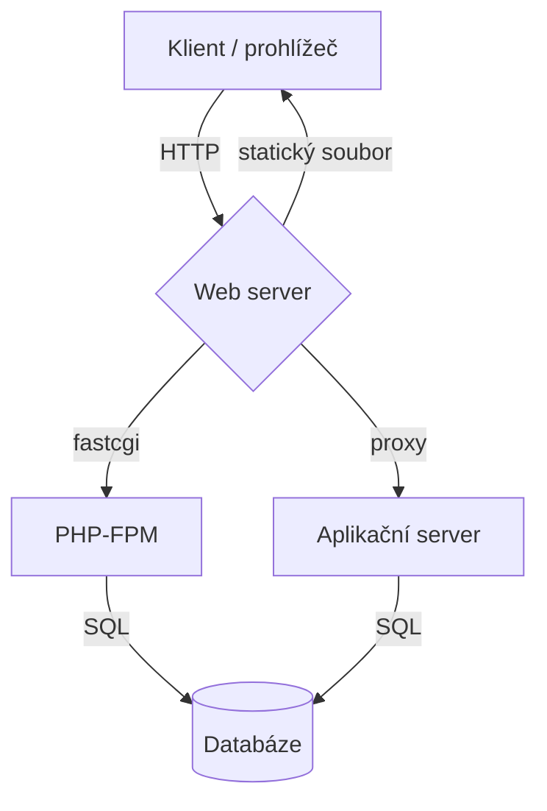
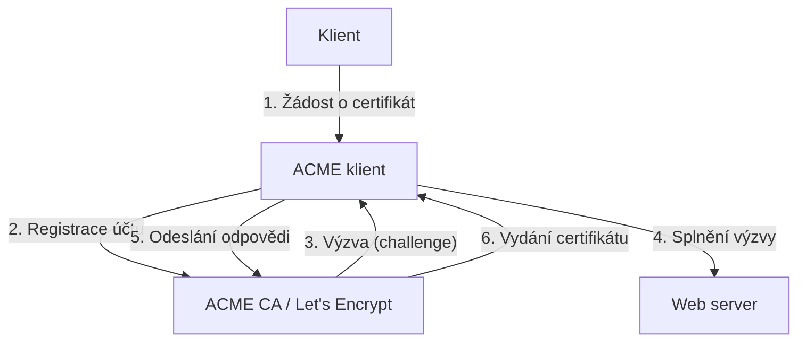

# 26. Webový server (Apache, Nginx, ACME)
> **Webový server** — Apache2, Nginx, aplikační servery, ACME/HTTPS, logování a troubleshooting

---

## Úvod

Webový server je softwarová služba, která přijímá HTTP požadavky od klientů (webových prohlížečů, API klientů) a vrací jim odpovědi – statické soubory (HTML, CSS, JS, obrázky) nebo dynamický obsah vygenerovaný aplikačním serverem. V operačním systému funguje jako síťová služba naslouchající na definovaných portech (nejčastěji 80 pro HTTP a 443 pro HTTPS).

V Linuxovém prostředí dominují dva webové servery, každý s odlišnou filozofií:

- **Apache2** — modulární, flexibilní, tradiční. Každý požadavek obsluhuje samostatné vlákno nebo proces. Díky modulům (mod_rewrite, mod_proxy) lze přidávat funkce za běhu. Konfigurace podporuje `.htaccess` soubory, které umožňují nastavení adresářů bez restartu serveru.
- **Nginx** — událostmi řízený (event-driven), vysoce výkonný, navržený jako reverse proxy. Jeden proces obsluhuje tisíce spojení najednou. Konfigurace je hierarchická (`http → server → location`) a nepodporuje `.htaccess`.

Proč se učit oba? Apache je stále rozšířený na sdíleném hostingu a v legacy prostředích. Nginx je dnes standardem pro nové projekty, cloudová nasazení a microservisní architekturu. Znalost obou je pro správce Linuxového serveru nezbytná.

Typický tok požadavku na webovém serveru vypadá takto:



Klient odešle HTTP požadavek na web server. Pokud server najde statický soubor, vrátí jej přímo. Pokud jde o dynamický obsah (PHP skript, Python aplikaci), předá požadavek aplikačnímu serveru (PHP-FPM, gunicorn) přes FastCGI nebo reverse proxy. Ten ve spolupráci s databází vygeneruje odpověď, která putuje zpět klientovi.

> **Předpoklady:** Základní znalost apt ([kapitola 10](10-aktualizace-systemu.md)), systemctl ([kapitola 20](20-systemd.md)) a firewallu ([kapitola 24](24-firewall.md)).

---

## 1. Apache2

Apache HTTP Server (zkráceně Apache2) je nejstarší a stále nejpoužívanější webový server na světě. Na Debianu a Ubuntu se instaluje jako balíček `apache2` a po instalaci je ihned připraven k použití.

### Instalace a základní správa

```bash
sudo apt install apache2
sudo systemctl start apache2
sudo systemctl enable apache2
sudo systemctl status apache2
```

Po instalaci Apache2 automaticky naslouchá na portu 80. Stav ověříte příkazem `curl http://localhost` nebo `ss -tlnp | grep ':80 '`. Výstup `systemctl status apache2` by měl ukazovat `active (running)`.

### Konfigurace

Konfigurace Apache2 na Debianu je rozdělena do několika adresářů a souborů v `/etc/apache2/`:

| Soubor / adresář | Účel |
|------------------|------|
| `apache2.conf` | Globální konfigurace — hlavní soubor, který includuje ostatní části |
| `ports.conf` | Nastavení portů — direktivy Listen pro HTTP (80) a HTTPS (443) |
| `sites-available/` | Definice virtuálních hostitelů — jeden `.conf` soubor na doménu |
| `sites-enabled/` | Symbolické odkazy na aktivní vhosty z `sites-available/` |
| `mods-available/` | Dostupné moduly — každý modul vlastní `.load` a `.conf` soubor |
| `mods-enabled/` | Symbolické odkazy na aktivní moduly |
| `conf-available/` | Doplňkové konfigurační fragmenty (např. ServerName, bezpečnostní hlavičky) |
| `conf-enabled/` | Symbolické odkazy na aktivní fragmenty |

Debian přidává několik užitečných nástrojů pro správu Apache:

```bash
# Povolení / zakázání modulu
sudo a2enmod rewrite
sudo a2dismod autoindex

# Povolení / zakázání virtuálního hostitele
sudo a2ensite example.conf
sudo a2dissite 000-default.conf

# Povolení / zakázání konfiguračního fragmentu
sudo a2enconf servername
sudo a2disconf other

# Přehled aktuální konfigurace (virtuální hostitelé, porty, ServerName)
sudo apache2ctl -S
```

`apache2ctl -S` zobrazí syntézu konfigurace — seznam virtuálních hostitelů, jejich porty, nastavený ServerName a načtené moduly:

```
VirtualHost configuration:
*:80                   example.com (/etc/apache2/sites-enabled/example.conf:1)
*:80                   is a NameVirtualHost
                         default server 000-default.conf (/etc/apache2/sites-enabled/000-default.conf:1)
ServerRoot: "/etc/apache2"
Main DocumentRoot: "/var/www/html"
Main ErrorLog: "/var/log/apache2/error.log"
```

### Virtuální hostitel

Virtuální hostitel (virtual host) umožňuje obsluhovat více domén na jednom serveru. Každý vhost je definován v samostatném souboru v `/etc/apache2/sites-available/`. Po instalaci je aktivní pouze výchozí vhost `000-default.conf`, který obsluhuje `http://localhost` s DocumentRoot `/var/www/html`. Následující příklad definuje vhost pro doménu `example.com`:

```apache
<VirtualHost *:80>
    ServerName example.com
    DocumentRoot /var/www/example

    <Directory /var/www/example>
        Options Indexes FollowSymLinks
        AllowOverride All
        Require all granted
    </Directory>

    ErrorLog ${APACHE_LOG_DIR}/example-error.log
    CustomLog ${APACHE_LOG_DIR}/example-access.log combined
</VirtualHost>
```

Aktivace vhostu:

```bash
sudo a2ensite example.conf
sudo systemctl reload apache2
```

> **Důležité:** Direktiva `AllowOverride All` umožňuje použití `.htaccess` souborů. To je flexibilní, ale zvyšuje režii — Apache musí na každý požadavek kontrolovat `.htaccess` v každém adresáři cesty. Pro produkční nasazení zvažte `AllowOverride None` a konfiguraci přímo přes `<Directory>` bloky.

### Moduly

Apache2 je modulární server — většina funkcí je implementována v modulech, které lze zapínat a vypínat bez překompilování. Na Debianu 12 je výchozím multiprocessing módem `mpm_event`.

Základní moduly pro webový server:

| Modul | Účel |
|-------|------|
| `mpm_event` | Moderní multi-processing modul (výchozí na Debian 12). Kombinuje procesy, vlákna a event loop pro efektivní zpracování desítek tisíc spojení. |
| `rewrite` | URL rewriting (mod_rewrite) — přesměrování, úpravy cest, SEO-friendly URL bez změny souborové struktury. |
| `proxy` + `proxy_http` | Reverse proxy — předávání požadavků na backend server (gunicorn, Node.js), včetně podpory HTTP/1.1. |
| `proxy_fcgi` | FastCGI proxy — propojení s PHP-FPM. Nahrazuje zastaralý `mod_php`. |
| `ssl` | HTTPS/SSL terminace — šifrovaná komunikace pomocí OpenSSL, podpora TLS 1.2 a 1.3. |

Aktivace všech modulů najednou:

```bash
sudo a2enmod mpm_event rewrite proxy proxy_http proxy_fcgi ssl
```

Po změně modulů je třeba restartovat Apache, aby se nové moduly načetly:

```bash
sudo systemctl restart apache2
```

### Troubleshooting Apache

Nejčastější problémy a jejich řešení:

```bash
# Test syntaxe konfigurace
sudo apachectl configtest
# nebo alternativa
sudo apache2ctl -t

# Kontrola logů přes systemd
sudo journalctl -u apache2 -n 50 --no-pager

# ServerName warning (AH00558) — výchozí varování při startu
echo "ServerName localhost" | sudo tee /etc/apache2/conf-available/servername.conf
sudo a2enconf servername
sudo systemctl reload apache2

# Permission denied — zkontrolovat práva na DocumentRoot a PHP socket
ls -la /var/www/
ls -la /var/run/php/

# Port conflict — například Apache vs Nginx na portu 80
sudo ss -tlnp | grep ':80 '
```

Apache na Debianu nabízí tři multiprocessing moduly (MPM). Liší se modelem zpracování spojení a hodí se pro různé scénáře:

| MPM | Model | Použití |
|-----|-------|---------|
| prefork | Jeden proces na spojení | mod_php (zastaralé, vysoká spotřeba paměti) |
| worker | Procesy + vlákna | Legacy systémy (kompromis mezi prefork a event) |
| event | Procesy + vlákna + event loop | Moderní (výchozí, doporučený) |

MPM `prefork` je nejjednodušší, ale také nejméně efektivní — každé spojení dostane samostatný proces, což při mnoha paralelních spojeních vede k vysoké spotřebě paměti. MPM `event` je naopak nejmodernější — udržuje otevřená spojení v event loopu a zpracovává je bez zbytečného vytváření nových procesů. Je výchozí volbou pro Debian 12 a všechny nové instalace.

---

## 2. Nginx

Nginx (vyslovováno "engine-x") je webový server navržený pro vysoký výkon a nízkou spotřebu paměti. Na rozdíl od Apache není modulární za běhu — moduly se kompilují přímo do binárky. Jeho hlavní doménou je obsluha statických souborů, reverse proxy a load balancing.

### Instalace a základní správa

```bash
sudo apt install nginx
sudo systemctl start nginx
sudo systemctl enable nginx
sudo systemctl status nginx
sudo systemctl reload nginx   # graceful reload bez výpadku
```

Po instalaci Nginx automaticky naslouchá na portu 80. Ověření: `curl http://localhost`. Důležitý rozdíl oproti Apache — `systemctl reload nginx` provede graceful reload. Nginx znovu načte konfiguraci, aniž by přerušil stávající spojení. To je klíčové pro produkční servery, kde nesmí dojít k výpadku.

### Konfigurace

Konfigurace Nginx je hierarchická a centralizovaná v `/etc/nginx/`. Na rozdíl od Apache nepodporuje `.htaccess` soubory — veškerá konfigurace je v hlavních souborech.

| Soubor / adresář | Účel |
|------------------|------|
| `nginx.conf` | Hlavní konfigurační soubor — user, worker_processes, http blok, include direktivy |
| `sites-available/` | Definice server bloků (jednotlivé soubory, ekvivalent Apache vhostů) |
| `sites-enabled/` | Symbolické odkazy na aktivní servery z `sites-available/` |
| `conf.d/` | Doplňkové konfigurační fragmenty (např. gzip, caching, security hlavičky) |

Struktura konfigurace je stromová:

```
http {
    server {
        location / {
            ...
        }
        location /api/ {
            ...
        }
    }
}
```

Klíčové direktivy v `nginx.conf`:

- `worker_processes` — počet pracovních procesů. Obvykle `auto` (odpovídá počtu jader CPU).
- `worker_connections` — maximální počet současných spojení na jeden proces.
- `events` blok — nastavení event loop (epoll na Linuxu).
- `http` blok — všechny direktivy pro HTTP provoz (server, location, upstream).

### Server block

Server block je v Nginx ekvivalent virtuálního hostitele v Apache. Následující příklad definuje server pro doménu `example.com` s podporou PHP:

```nginx
server {
    listen 80;
    server_name example.com;
    root /var/www/example;
    index index.html index.htm;

    location / {
        try_files $uri $uri/ =404;
    }

    location ~ \.php$ {
        include snippets/fastcgi-php.conf;
        fastcgi_pass unix:/var/run/php/php8.2-fpm.sock;
    }

    access_log /var/log/nginx/example-access.log;
    error_log /var/log/nginx/example-error.log;
}
```

Aktivace server bloku:

```bash
sudo ln -s /etc/nginx/sites-available/example /etc/nginx/sites-enabled/
sudo nginx -t && sudo systemctl reload nginx
```

`nginx -t` otestuje syntaxi celé konfigurace:

```
$ sudo nginx -t
nginx: the configuration file /etc/nginx/nginx.conf syntax is ok
nginx: the configuration file /etc/nginx/nginx.conf test is successful
```

Pokud detekuje chybu, vypíše ji včetně čísla řádku a souboru. Teprve po úspěšném testu následuje reload. Tento dvoukrokový postup zabraňuje pádu serveru kvůli překlepu v konfiguraci.

### Reverse proxy

Reverse proxy je způsob, jak předat požadavek z Nginx na backendový aplikační server. Nginx v tomto režimu funguje jako vstupní brána — přijímá požadavky z internetu, předává je interním službám a vrací jejich odpovědi klientovi.

```nginx
location /api/ {
    proxy_pass http://localhost:3000;
    proxy_set_header Host $host;
    proxy_set_header X-Real-IP $remote_addr;
    proxy_set_header X-Forwarded-For $proxy_add_x_forwarded_for;
    proxy_set_header X-Forwarded-Proto $scheme;
}
```

Direktivy:

- `proxy_pass` — URL backend serveru. Může být HTTP (`http://localhost:3000`) nebo unix socket (`http://unix:/tmp/myapp.sock`).
- `proxy_set_header Host $host` — předání původního Host headeru, aby backend věděl, na jakou doménu požadavek směřuje.
- `proxy_set_header X-Real-IP $remote_addr` — předání IP adresy klienta (backend jinak vidí jen IP Nginx).
- `proxy_set_header X-Forwarded-For` — seznam IP adres, kterými požadavek prošel. Umožňuje backendu zjistit původního klienta.
- `proxy_set_header X-Forwarded-Proto $scheme` — informace o protokolu (http / https).

Pro pokročilejší scénáře lze použít blok `upstream`, který definuje skupinu backend serverů a umožňuje load balancing:

```nginx
upstream backend {
    server 127.0.0.1:3000 weight=3;
    server 127.0.0.1:3001;
    server 127.0.0.1:3002 backup;
}

server {
    listen 80;
    server_name api.example.com;

    location / {
        proxy_pass http://backend;
        proxy_set_header Host $host;
        proxy_set_header X-Real-IP $remote_addr;
    }
}
```

Nginx podporuje několik metod load balancingu: round-robin (výchozí), least_connections, IP hash a generic hash. Direktiva `backup` označuje záložní server, který se použije jen když jsou ostatní nedostupné.

Toto nastavení je klíčové pro propojení Nginx s aplikačními servery — gunicornem (Python), PM2 (Node.js) nebo jiným backendem (viz sekce 3). Bez správného předání hlaviček backend nepozná skutečnou IP adresu klienta ani původní protokol.

### Troubleshooting Nginx

```bash
# Test syntaxe konfigurace
sudo nginx -t

# Kontrola error logu
sudo journalctl -u nginx -n 50 --no-pager

# Permission denied na access log
ls -la /var/log/nginx/
sudo chown www-data:adm /var/log/nginx/access.log

# Port 80 už je obsazený — konflikt Apache vs Nginx
sudo ss -tlnp | grep ':80 '
# Pokud běží Apache: sudo systemctl stop apache2

# 502 Bad Gateway — PHP-FPM neběží nebo neodpovídá
sudo systemctl status php8.2-fpm
ls -la /var/run/php/   # zkontrolovat, zda socket existuje
# Pokud socket chybí: sudo systemctl start php8.2-fpm
```

Nejčastější HTTP chyby a jejich příčiny:

- **502 Bad Gateway** — Aplikační server (PHP-FPM, gunicorn) neběží nebo nenaslouchá na očekávaném socketu či portu. Zkontrolujte `systemctl status` a existenci socket souboru.
- **404 Not Found** — Špatně nastavená `root` direktiva nebo `try_files`. Ověřte, že soubor na disku skutečně existuje v cestě uvedené v `root`.
- **403 Forbidden** — Web server nemá právo číst soubory. Zkontrolujte vlastnictví (vlastník `www-data`) a práva (755 pro adresáře, 644 pro soubory).
- **Connection refused** — Nginx se pokouší připojit na backend (`proxy_pass`), který není spuštěný nebo nenaslouchá. Zkontrolujte, zda backend služba běží.

---

## 3. Aplikační servery

Aplikační server (application server) je proces, který zpracovává dynamický obsah webové aplikace. Na rozdíl od webového serveru (Apache, Nginx), který obsluhuje statické soubory a předává dynamické požadavky dál, aplikační server spouští kód aplikace (PHP, Python, Node.js) a generuje odpověď.

Tři nejčastější scénáře:

- **PHP** — PHP-FPM, FastCGI proces, na který se web server připojuje přes FastCGI protokol.
- **Python** — gunicorn, WSGI server, na který se web server připojuje přes reverse proxy.
- **Node.js** — PM2, process manager, který spouští JavaScript aplikaci a web server k ní přistupuje přes reverse proxy.

Všechny tři scénáře sdílejí stejný vzor: web server naslouchá na portu 80/443 (veřejný provoz), aplikační server naslouchá na interním portu nebo unix socketu (pouze localhost). Web server rozhoduje, které požadavky předá na aplikační server a které obslouží sám (statické soubory).

> **Předpoklady:** Základní znalost systemd ([kapitola 20](20-systemd.md)) a firewallu ([kapitola 24](24-firewall.md)).

### PHP-FPM

PHP-FPM (FastCGI Process Manager) je implementace FastCGI protokolu pro PHP. Nahrazuje zastaralý `mod_php` (mod_php7, mod_php8), který běžel přímo v procesu Apache a blokoval ostatní spojení. PHP-FPM běží jako samostatný proces, se kterým web server komunikuje přes FastCGI. Požadavky se neblokují a jeden pád PHP skriptu nesrazí celý server.

#### Instalace

```bash
sudo apt install php-fpm
# Konkrétní verze (Debian 12):
sudo apt install php8.2-fpm
```

Po instalaci je PHP-FPM dostupný jako systemd služba:

```bash
sudo systemctl start php8.2-fpm
sudo systemctl enable php8.2-fpm
sudo systemctl status php8.2-fpm
```

#### Pool konfigurace

Hlavní konfigurace PHP-FPM je v adresáři `/etc/php/8.2/fpm/`:

| Soubor | Účel |
|--------|------|
| `php.ini` | Globální nastavení PHP (memory_limit, upload_max_filesize, timezone) |
| `pool.d/www.conf` | Konfigurace poolu (procesy, socket, uživatel) |
| `php-fpm.conf` | Globální nastavení FPM (PID soubor, log level) |

Každý pool definuje skupinu procesů, které zpracovávají PHP požadavky. Výchozí pool se jmenuje `www`. Klíčové parametry v `/etc/php/8.2/fpm/pool.d/www.conf`:

```ini
; Uživatel a skupina, pod kterými PHP-FPM běží
; Důležité pro oprávnění k souborům
user = www-data
group = www-data

; Způsob řízení procesů
; dynamic = počet procesů se mění podle zátěže
; static = pevný počet procesů
; ondemand = procesy se vytvářejí jen při požadavku
pm = dynamic

; Maximální počet současných procesů (dětí)
pm.max_children = 50

; Počet procesů při startu
pm.start_servers = 5

; Minimální počet volných procesů (čekajících na požadavek)
pm.min_spare_servers = 5

; Maximální počet volných procesů
pm.max_spare_servers = 35

; Počet požadavků, po kterém se proces restartuje
; Chrání před únikem paměti
pm.max_requests = 500

; Způsob naslouchání
; unix socket (rychlejší) nebo TCP (lze přes síť)
listen = /run/php/php8.2-fpm.sock
; Alternativa pro TCP:
; listen = 127.0.0.1:9000
```

#### Výpočet max_children

`pm.max_children` je nejdůležitější parametr. Pokud je příliš nízký, požadavky se frontují a web zpomaluje. Pokud je příliš vysoký, server může dojít paměť. Základní vzorec:

```
max_children = (celková RAM - RAM pro OS a ostatní služby) / průměrná RAM na jeden PHP proces
```

Příklad: Server s 8 GB RAM, Debian + Nginx + MySQL spotřebuje ~3 GB, jeden PHP proces ~40 MB:

```
max_children = (8192 - 3072) / 40 = 128
```

V praxi začněte s konzervativní hodnotou a sledujte paměť:

```bash
# Sledování paměti PHP-FPM procesů
ps aux | grep php-fpm | awk '{sum+=$6; count++} END {print "Avg MB:", sum/count/1024, "Count:", count-1}'
```

#### Propojení s Apache

Apache se připojuje k PHP-FPM přes modul `proxy_fcgi`:

```apache
<VirtualHost *:80>
    ServerName example.com
    DocumentRoot /var/www/example

    ProxyPassMatch ^/(.*\.php)$ unix:/run/php/php8.2-fpm.sock|fcgi://localhost/var/www/example/
</VirtualHost>
```

`ProxyPassMatch` zachytí všechny požadavky končící na `.php` a předá je PHP-FPM přes unix socket. Zbytek požadavků (statické soubory) obslouží Apache přímo.

#### Propojení s Nginx

Nginx se připojuje přes `fastcgi_pass`:

```nginx
server {
    listen 80;
    server_name example.com;
    root /var/www/example;
    index index.php index.html;

    location / {
        try_files $uri $uri/ =404;
    }

    location ~ \.php$ {
        include snippets/fastcgi-php.conf;
        fastcgi_pass unix:/run/php/php8.2-fpm.sock;
    }
}
```

Direktiva `include snippets/fastcgi-php.conf` nastaví standardní FastCGI parametry (rozdělení `SCRIPT_FILENAME`, `PATH_INFO`). `fastcgi_pass` určuje cestu k PHP-FPM socketu.

### Python (gunicorn)

Gunicorn (Green Unicorn) je WSGI server pro Python aplikace. WSGI (Web Server Gateway Interface) je standard pro propojení Python webových aplikací (Django, Flask, FastAPI) s webovým serverem. Gunicorn nepřebírá HTTP požadavky přímo z internetu. Očekává, že před ním stojí reverse proxy (Nginx, Apache), který předává požadavky.

#### Instalace

```bash
pip install gunicorn
# Nebo v rámci projektu (doporučeno)
pip install gunicorn flask
```

#### Základní spuštění

```bash
# Spuštění Flask aplikace (soubor app.py, proměnná app)
gunicorn --workers 4 --bind unix:/tmp/myapp.sock app:app

# Spuštění Django aplikace
gunicorn --workers 4 --bind unix:/tmp/myapp.sock myproject.wsgi

# Spuštění přes TCP (pro testování)
gunicorn --workers 4 --bind 127.0.0.1:8000 app:app
```

#### Konfigurace parametrů

| Parametr | Význam | Doporučení |
|----------|--------|------------|
| `--workers` | Počet pracovních procesů | 2-4x počet CPU jader |
| `--worker-class` | Typ workeru (`sync`, `gevent`, `uvicorn`) | `sync` pro běžné aplikace |
| `--bind` | Adresa a port nebo unix socket | `unix:/tmp/myapp.sock` pro produkci |
| `--timeout` | Timeout na jeden požadavek (s) | 30-120 podle aplikace |
| `--max-requests` | Restart procesu po N požadavcích | 1000 (proti úniku paměti) |
| `--access-logfile` | Cesta k access logu | `/var/log/myapp/access.log` |
| `--error-logfile` | Cesta k error logu | `/var/log/myapp/error.log` |

Příklad s parametry:

```bash
gunicorn --workers 4 \
         --worker-class sync \
         --bind unix:/tmp/myapp.sock \
         --timeout 60 \
         --max-requests 1000 \
         --access-logfile /var/log/myapp/access.log \
         --error-logfile /var/log/myapp/error.log \
         app:app
```

#### Systemd unit

Pro produkční provoz se gunicorn spouští přes systemd. Unit soubor `/etc/systemd/system/myapp.service`:

```ini
[Unit]
Description=My Python Application
After=network.target

[Service]
User=www-data
Group=www-data
WorkingDirectory=/opt/myapp
ExecStart=/usr/local/bin/gunicorn --workers 4 \
    --bind unix:/tmp/myapp.sock app:app
Restart=always
RestartSec=5

[Install]
WantedBy=multi-user.target
```

Aktivace:

```bash
sudo systemctl daemon-reload
sudo systemctl start myapp
sudo systemctl enable myapp
```

#### Propojení s Nginx

Nginx předává požadavky gunicornu přes `proxy_pass`:

```nginx
server {
    listen 80;
    server_name api.example.com;

    location / {
        proxy_pass http://unix:/tmp/myapp.sock;
        proxy_set_header Host $host;
        proxy_set_header X-Real-IP $remote_addr;
        proxy_set_header X-Forwarded-For $proxy_add_x_forwarded_for;
        proxy_set_header X-Forwarded-Proto $scheme;
    }
}
```

> **Důležité:** Nginx vždy předává hlavičky Host, X-Real-IP, X-Forwarded-For a X-Forwarded-Proto. Bez nich Python aplikace nepozná skutečnou IP adresu klienta ani původní protokol (HTTP vs HTTPS).

### Node.js (PM2)

PM2 je process manager pro Node.js aplikace. Umožňuje spouštět JavaScript aplikace jako démona, automaticky restartovat při pádu, škálovat na více jader (clustering) a spravovat logy.

#### Instalace

```bash
npm install -g pm2
```

#### Základní příkazy

```bash
# Spuštění aplikace
pm2 start app.js --name myapp

# Spuštění s clusteringem (využití všech jader)
pm2 start app.js --name myapp -i max

# Seznam procesů
pm2 list

# Zastavení / restart
pm2 stop myapp
pm2 restart myapp

# Zobrazení logů
pm2 logs myapp

# Sledování v reálném čase (dashboard)
pm2 monit
```

PM2 ve výchozím režimu spouští aplikaci v jednom procesu (fork mode). S parametrem `-i max` aktivuje cluster mode, ve kterém vytvoří tolik procesů, kolik je CPU jader:

```
$ pm2 list
┌─────┬───────┬─────────┬──────┬────────┬─────┬────────┬──────┐
│ id  │ name  │ mode    │ ↺    │ status │ cpu │ memory │ uptime │
├─────┼───────┼─────────┼──────┼────────┼─────┼────────┼──────┤
│ 0   │ myapp │ cluster │ 0    │ online │ 0%  │ 45.8MB │ 2h    │
│ 1   │ myapp │ cluster │ 0    │ online │ 0%  │ 42.1MB │ 2h    │
│ 2   │ myapp │ cluster │ 0    │ online │ 0%  │ 43.5MB │ 2h    │
│ 3   │ myapp │ cluster │ 0    │ online │ 0%  │ 44.2MB │ 2h    │
└─────┴───────┴─────────┴──────┴────────┴─────┴────────┴──────┘
```

#### Startup (automatické spuštění při bootu)

```bash
# Uložení seznamu procesů
pm2 save

# Generování startup skriptu pro systemd
pm2 startup
```

PM2 vytvoří systemd unit, který při startu systému automaticky spustí všechny uložené procesy.

#### Propojení s Nginx

Node.js aplikace typicky naslouchá na TCP portu (3000, 8080). Nginx předává požadavky přes `proxy_pass`:

```nginx
server {
    listen 80;
    server_name app.example.com;

    location / {
        proxy_pass http://localhost:3000;
        proxy_set_header Host $host;
        proxy_set_header X-Real-IP $remote_addr;
        proxy_set_header X-Forwarded-For $proxy_add_x_forwarded_for;
        proxy_set_header X-Forwarded-Proto $scheme;
    }

    location /static/ {
        alias /var/www/app/static/;
        expires 30d;
    }
}
```

> **Tip:** Statické soubory (CSS, JS, obrázky) obsluhuje přímo Nginx přes `alias`. Node.js aplikace se jimi nemusí zabývat a šetří se výkon.

### Reverse proxy konfigurace

Reverse proxy je jednotící vzor pro všechny tři scénáře. Web server stojí před aplikačním serverem a rozhoduje, co kam předá.

#### Nginx

```nginx
location / {
    proxy_pass http://localhost:3000;
    proxy_set_header Host $host;
    proxy_set_header X-Real-IP $remote_addr;
    proxy_set_header X-Forwarded-For $proxy_add_x_forwarded_for;
    proxy_set_header X-Forwarded-Proto $scheme;
}
```

| Direktiva | Význam |
|-----------|--------|
| `proxy_pass` | Cílová adresa backend serveru (TCP nebo unix socket) |
| `proxy_set_header Host` | Předání původního Host headeru |
| `proxy_set_header X-Real-IP` | Skutečná IP klienta |
| `proxy_set_header X-Forwarded-For` | Řetězec IP adres (proxy chain) |
| `proxy_set_header X-Forwarded-Proto` | Původní protokol (http/https) |

#### Apache

```apache
<VirtualHost *:80>
    ServerName app.example.com

    ProxyPreserveHost On
    ProxyPass / http://localhost:3000/
    ProxyPassReverse / http://localhost:3000/
</VirtualHost>
```

| Direktiva | Význam |
|-----------|--------|
| `ProxyPreserveHost On` | Předání původního Host headeru |
| `ProxyPass` | Cílová adresa backend serveru |
| `ProxyPassReverse` | Přepis Location hlaviček v odpovědi |

Pro Apache je nutné mít aktivní moduly `proxy` a `proxy_http`:

```bash
sudo a2enmod proxy proxy_http
sudo systemctl restart apache2
```

---

## 4. ACME a HTTPS

HTTPS (HTTP over TLS) je dnes standardem pro každý webový server. Šifrovaná komunikace chrání data při přenosu, ověřuje identitu serveru a je vyžadována moderními prohlížeči pro mnoho funkcí (geolokace, Service Workers, HTTP/2).

Proč HTTPS:

- **Šifrování** — data mezi klientem a serverem jsou chráněna před odposlechem.
- **Důvěryhodnost** — certifikát ověřuje, že server skutečně patří dané doméně.
- **SEO** — Google preferuje HTTPS stránky ve výsledcích vyhledávání.
- **HTTP/2 a HTTP/3** — tyto protokoly vyžadují nebo doporučují TLS.
- **Bezpečnostní funkce** — mnoho API (Geolocation, Service Workers) vyžaduje HTTPS.

### Co je ACME

ACME (Automatic Certificate Management Environment, RFC 8555) je protokol pro automatické vydávání a správu TLS certifikátů. Jeho cílem je zcela eliminovat manuální práci při zřizování HTTPS.

Princip je jednoduchý:

1. **Žádost** — klient požádá ACME server o certifikát pro danou doménu.
2. **Registrace** — klient se zaregistruje u ACME serveru (vytvoří účet).
3. **Výzva** — ACME server pošle klientovi výzvu k ověření vlastnictví domény.
4. **Splnění** — klient prokáže kontrolu nad doménou (např. umístěním souboru na web server).
5. **Ověření** — ACME server zkontroluje, zda výzva byla splněna.
6. **Vydání** — pokud je ověření úspěšné, ACME server vydá certifikát.



### Let's Encrypt

Let's Encrypt je první volně dostupná certifikační autorita (CA) používající ACME protokol. Spuštěna byla v roce 2016 a dnes je největší CA na světě. Díky ní má každý majitel domény přístup k bezplatným TLS certifikátům.

### Způsoby ověření (challenge)

ACME podporuje několik typů výzev k ověření vlastnictví domény:

| Metoda | Princip | Výhody | Nevýhody |
|--------|---------|--------|----------|
| **HTTP-01** | Umístění souboru do `/.well-known/acme-challenge/` | Jednoduché, žádné DNS změny | Jen pro HTTP port 80, ne pro wildcard |
| **DNS-01** | Přidání TXT záznamu do DNS | Podpora wildcard certifikátů, bez nutnosti web serveru | Vyžaduje DNS API, pomalejší |
| **TLS-ALPN-01** | TLS handshake na portu 443 s ALPN extension | Bez změn na web serveru | Vyžaduje přístup k portu 443 |

HTTP-01 je nejpoužívanější. Klient umístí speciální soubor do adresáře `/.well-known/acme-challenge/` a ACME server si jej stáhne přes HTTP. Pokud soubor obsahuje očekávaný token, je vlastnictví domény potvrzeno.

DNS-01 je vhodný pro wildcard certifikáty (`*.example.com`). Klient přidá TXT záznam do DNS zóny a ACME server jej ověří.

### Obnova certifikátů

Certifikáty Let's Encrypt mají platnost 90 dní. ACME protokol podporuje automatickou obnovu. Klient pravidelně kontroluje, zda certifikát nevyprší, a v případě potřeby zažádá o nový.

Standardní postup:

```bash
# Kontrola platnosti certifikátu
openssl x509 -in /etc/ssl/certs/example.pem -noout -dates
# notBefore=Jan 17 00:00:00 2025 GMT
# notAfter=Apr 17 00:00:00 2025 GMT
```

> **Poznámka:** Praktická implementace ACME klientů (certbot, acme.sh, dehydrated) přesahuje rámec této kapitoly. Základy práce s OpenSSL a certifikáty jsou popsány v [kapitole 7](07-bezpecna-architektura.md). Pro správu systemd služeb (včetně timerů pro automatickou obnovu) viz [kapitola 20](20-systemd.md).

---

## 5. Logování

Webový server zaznamenává každý příchozí požadavek do log souborů. Logy jsou klíčové pro monitorování, ladění a bezpečnostní audit.

### Access log

| Vlastnost | Apache2 | Nginx |
|-----------|---------|-------|
| Cesta | `/var/log/apache2/access.log` | `/var/log/nginx/access.log` |
| Výchozí formát | combined | combined |

Common log format:
```
127.0.0.1 - frank [10/Oct/2000:13:55:36 -0700] "GET /index.html HTTP/1.0" 200 2326
```

Combined format přidává referer a user-agent:
```
127.0.0.1 - - [10/Oct/2000:13:55:36 -0700] "GET /index.html HTTP/1.1" 200 2326 "https://example.com/" "Mozilla/5.0 ..."
```

Význam polí: `$remote_addr` (IP), `$remote_user` (HTTP auth), `$time_local` (čas), `$request` (metoda+URI), `$status` (kód), `$body_bytes_sent` (velikost), `$http_referer`, `$http_user_agent`.

### Error log

| Server | Cesta |
|--------|-------|
| Apache2 | `/var/log/apache2/error.log` |
| Nginx | `/var/log/nginx/error.log` |

Severity: `debug → info → notice → warn → error → crit → alert → emerg`. Apache2 loguje od `warn`, Nginx od `error`.

```bash
LogLevel warn                                    # Apache2
error_log /var/log/nginx/error.log warn;         # Nginx
```

### Vlastní log formáty

Apache2 — `LogFormat`:
```apache
LogFormat "%h %l %u %t \"%r\" %>s %b" common
LogFormat "%h %l %u %t \"%r\" %>s %b \"%{Referer}i\" \"%{User-Agent}i\"" combined
```

Nginx — `log_format`:
```nginx
log_format combined '$remote_addr - $remote_user [$time_local] '
                    '"$request" $status $body_bytes_sent '
                    '"$http_referer" "$http_user_agent"';
```

### logrotate

Konfigurace v `/etc/logrotate.d/`. Příklad pro Nginx:

```
/var/log/nginx/*.log {
    daily
    rotate 7
    compress
    delaycompress
    missingok
    notifempty
    postrotate
        [ -f /var/run/nginx.pid ] && kill -USR1 `cat /var/run/nginx.pid` || true
    endscript
}
```

Test: `sudo logrotate -d /etc/logrotate.d/nginx`.

### Analýza logů

**goaccess**:
```bash
sudo apt install goaccess
goaccess /var/log/nginx/access.log --log-format=COMBINED
```

**awk**:
```bash
# Top 10 IP
awk '{print $1}' /var/log/nginx/access.log | sort | uniq -c | sort -rn | head -10
# HTTP status kódy
awk '{print $9}' /var/log/nginx/access.log | sort | uniq -c | sort -rn
```

> **Tip:** Pravidelná kontrola logů pomáhá odhalit útoky. Viz [kapitola 25](25-bezpecnostni-audit.md).

---

## 6. Praktický scénář

Nasazení PHP aplikace na čistém Debianu/Ubuntu s Nginx a PHP-FPM.

**Cíl:** Nasadit a otestovat PHP aplikaci na Debianu 12 nebo Ubuntu 22.04/24.04.

### Postup

#### 1. Instalace Nginx + PHP-FPM

```bash
sudo apt update && sudo apt upgrade -y
sudo apt install nginx -y
sudo systemctl start nginx
sudo systemctl enable nginx

sudo apt install php-fpm -y
sudo systemctl start php8.2-fpm
sudo systemctl enable php8.2-fpm
```

> **Poznámka:** Na Ubuntu 24.04 bude verze PHP pravděpodobně `php8.3-fpm`. Upravte podle verze v systému.

#### 2. Konfigurace server bloku

```bash
sudo mkdir -p /var/www/example
```

`/etc/nginx/sites-available/example`:

```nginx
server {
    listen 80;
    server_name _;
    root /var/www/example;
    index index.php index.html;

    location / {
        try_files $uri $uri/ =404;
    }

    location ~ \.php$ {
        include snippets/fastcgi-php.conf;
        fastcgi_pass unix:/run/php/php8.2-fpm.sock;
    }

    access_log /var/log/nginx/example-access.log;
    error_log /var/log/nginx/example-error.log;
}
```

```bash
sudo ln -s /etc/nginx/sites-available/example /etc/nginx/sites-enabled/
sudo nginx -t && sudo systemctl reload nginx
```

#### 3. Vytvoření PHP stránky

```bash
echo "<?php phpinfo(); ?>" | sudo tee /var/www/example/index.php
sudo chown -R www-data:www-data /var/www/example
sudo chmod -R 755 /var/www/example
```

#### 4. Test funkčnosti

```bash
curl -I http://localhost
curl http://localhost | grep "PHP Version"
```

Očekávaný výstup: HTML s PHP info. Pokud vidíte zdrojový kód, chybí `fastcgi_pass` nebo PHP-FPM neběží.

### Troubleshooting

Nejčastější problémy při nasazení PHP aplikace:

#### 502 Bad Gateway

**Příčina:** PHP-FPM neběží nebo socket neexistuje.

**Řešení:**
```bash
sudo systemctl status php8.2-fpm
sudo systemctl start php8.2-fpm
ls -la /run/php/           # zkontrolovat socket
sudo systemctl restart php8.2-fpm
```

#### 404 Not Found

**Příčina:** Špatně nastavená `root` direktiva nebo soubor neexistuje.

**Řešení:**
```bash
grep root /etc/nginx/sites-enabled/example   # ověřit cestu
ls -la /var/www/example/index.php            # zda soubor existuje
tail -n 5 /var/log/nginx/example-access.log
```

#### 403 Forbidden

**Příčina:** Web server nemá právo číst soubory.

**Řešení:**
```bash
sudo chown -R www-data:www-data /var/www/example
sudo chmod 755 /var/www /var/www/example
sudo chmod 644 /var/www/example/index.php
namei -l /var/www/example/index.php
```

#### File not found (primary script unknown)

**Příčina:** `cgi.fix_pathinfo` není správně nastavený.

**Řešení:**
```bash
grep cgi.fix_pathinfo /etc/php/8.2/fpm/php.ini
# Doporučeno: cgi.fix_pathinfo=0
sudo systemctl restart php8.2-fpm
```

### Kombinace nástrojů

Při nasazení a ladění se osvědčila tato kombinace:

```bash
# 1. Kontrola syntaxe (vždy před relodem)
sudo nginx -t

# 2. Restart / reload služeb
sudo systemctl reload nginx
sudo systemctl restart php8.2-fpm

# 3. Sledování logů v reálném čase
sudo journalctl -u nginx -f
sudo journalctl -u php8.2-fpm -f

# 4. Test HTTP odezvy
curl -s -o /dev/null -w "%{http_code}" http://localhost

# 5. Analýza access logu
goaccess /var/log/nginx/access.log --log-format=COMBINED -q

# 6. Rychlý přehled chyb
awk '$9 ~ /^[45][0-9][0-9]/ {print $9, $7, $1}' /var/log/nginx/access.log | sort | uniq -c | sort -rn
```

> **Důležité:** Po každé změně konfigurace vždy nejprve testujte syntaxi (`nginx -t`) a teprve poté proveďte reload. Tento postup zabrání pádu serveru kvůli překlepu. Viz [kapitola 22](22-reseni-problemu.md) pro obecný troubleshooting a [kapitola 10](10-aktualizace-systemu.md) pro správu balíčků.

---

## Shrnutí

Webový server je základní stavební kámen každé webové infrastruktury. Tato kapitola pokryla dva dominantní servery (Apache2 a Nginx), tři typy aplikačních serverů (PHP-FPM, gunicorn, PM2), automatické HTTPS certifikáty přes ACME protokol, správu logů a praktické nasazení PHP aplikace.

### Přehled nástrojů

| Nástroj | Účel | Instalace |
|---------|------|-----------|
| apache2 | HTTP server s podporou modulů a .htaccess | `apt install apache2` |
| nginx | HTTP server + reverse proxy s vysokým výkonem | `apt install nginx` |
| php-fpm | FastCGI proces manager pro PHP aplikace | `apt install php-fpm` |
| gunicorn | WSGI server pro Python aplikace | `pip install gunicorn` |
| pm2 | Process manager pro Node.js aplikace | `npm install -g pm2` |
| goaccess | Nástroj pro analýzu access logů v terminálu | `apt install goaccess` |

### Související kapitoly

- [Kapitola 7: Bezpečná architektura](07-bezpecna-architektura.md) — OpenSSL, TLS certifikáty, šifrování
- [Kapitola 10: Aktualizace systému](10-aktualizace-systemu.md) — správa balíčků pomocí apt
- [Kapitola 12: Práva souborů](12-prava-souboru.md) — vlastnictví a oprávnění souborů
- [Kapitola 20: Systemd](20-systemd.md) — správa služeb, systemctl, journalctl
- [Kapitola 22: Řešení problémů](22-reseni-problemu.md) — obecný troubleshooting a diagnostika
- [Kapitola 24: Firewall](24-firewall.md) — iptables, nftables, ufw

---

➡️ [Zpět na přehled](README.md)
